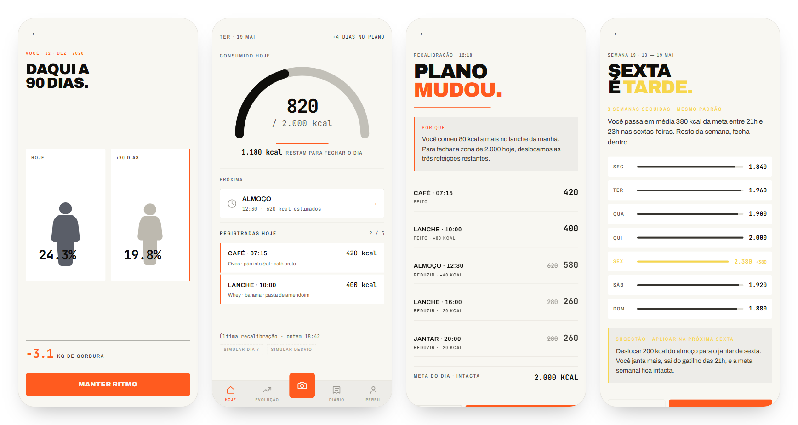
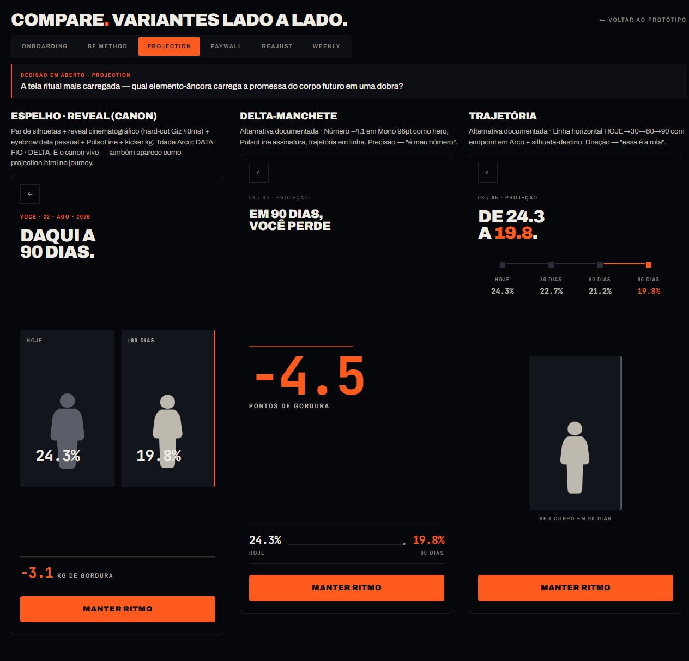
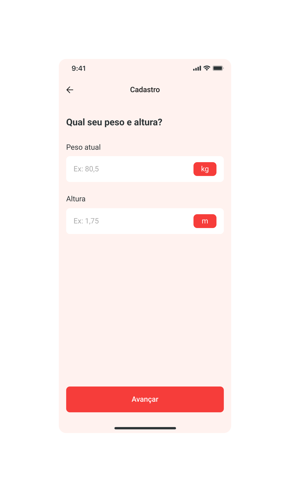
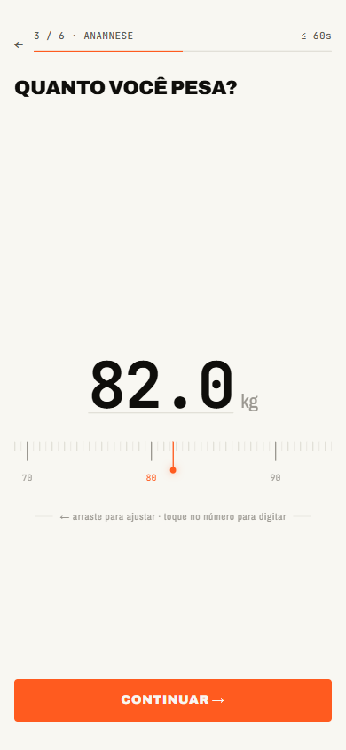
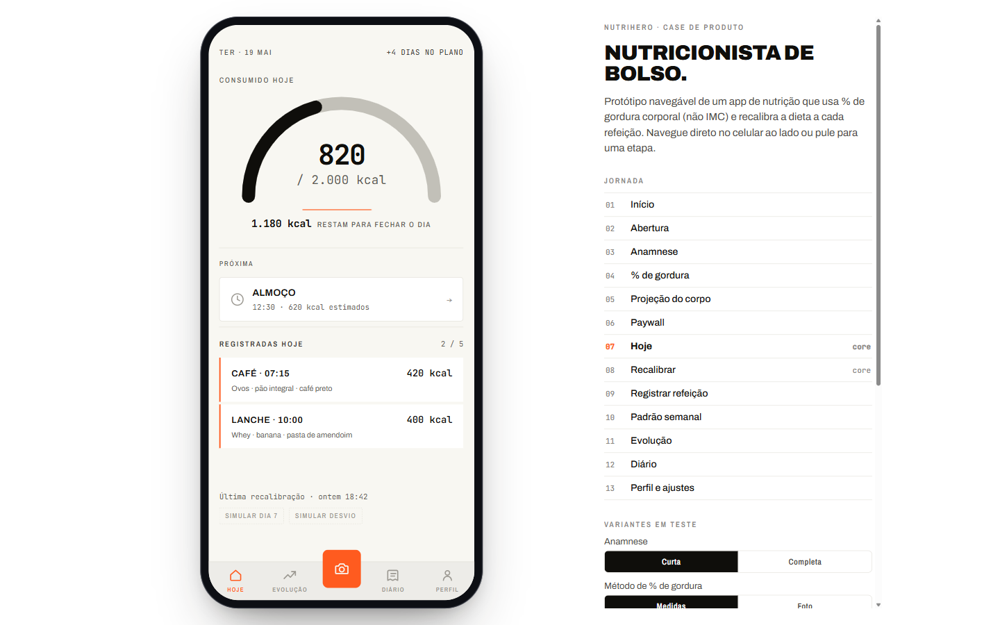

# NutriHero · a nutritionist in your pocket

<sub>English · [Português](README.pt-BR.md)</sub>

**Product case:** a 3-week sprint, from kick-off to handoff, for the MVP of a Brazilian nutrition app. It covers MVP strategy, brand direction, a design system and a high-fidelity clickable prototype.

**[▶ Open the prototype](https://luizrochaprojects-afk.github.io/nutrihero/prototype/)** · works on mobile and desktop



---

## The problem

The most popular diet apps set the calorie target from **BMI** (weight, height and age). Two people with the same BMI and different body fat percentages get the same diet, and one of them will get it wrong: either they gain fat or they lose lean mass.

Adjustment is also slow. A nutritionist recalibrates the diet every **three months**, and most people quit before the follow-up.

## The thesis

| | Diet apps today | NutriHero |
|---|---|---|
| **Core variable** | BMI | Body fat % (measurements or photo) |
| **Adjustment cycle** | Quarterly (appointment) | Daily (one button) + weekly (patterns) |
| **Role of the app** | Food diary | Pocket nutritionist that decides what is left |

The core interaction fits in one line: **open, eat, tap, follow.** The recalibrate button redistributes the day's remaining calories across the next meals.

## What I did

I ran the product and design sprint from kick-off to handoff:

1. **Immersion and scope cut.** The original vision had 8 fronts beyond the core (gamification, a nonprofit tie-in, workouts, community, a marketplace…). The MVP became **engine + readjustment + logging + paywall**. → [Brief](docs/00-brief.md) · [PRD](docs/process/prd-mvp.md)
2. **Brand direction.** Three directions explored. The chosen one, **"Pulso"** (pulse), treats the body as a measurable system and the user as an operator, not a patient. → [Direction](docs/01-brand-direction.md) · [Direction menu](docs/02-brand-direction-menu.html) · [Visual exploration](docs/02-brand-direction-visual.html)
3. **Design system.** Tokens, typography, contrast, states, motion and the signature component `PulsoLine`. → [Visual system](docs/03-visual-system.html)
4. **Identity and screens.** Logo, app icon and mockups of the key screens. → [Visual identity](docs/04-visual-identity.html)
5. **Prototype with variants.** 17 journey screens plus supporting screens, with **5 open product decisions** the reviewer toggles live. → [Prototype](prototype/)
6. **Handoff.** Stack, ready-to-paste tokens, a 14-day build order, screen-by-screen behavior and acceptance criteria. → [Dev handoff](docs/05-dev-handoff.md)

The documents are in Portuguese, the language the sprint ran in.

## Testable product decisions

Instead of defending one answer, the prototype puts the riskiest decisions side by side:

| Decision | Question | Variants |
|---|---|---|
| **Intake** | How much friction fits before the reveal? | 5 questions · 8 questions |
| **Body fat %** | Measurements are predictable; a photo sells more. Which opens the journey? | Measurements first · Photo first |
| **Paywall** | Where to ask for the card? | Before the calculation · After the projection · After the 1st readjustment |
| **Recalibration** | How does the new plan appear? | Animated ticker · Modal · Bottom sheet |
| **Weekly readjustment** | Where does the week's pattern land? | Card on Today · Dedicated screen · Push |



## Before and after

On the left, the draft the sprint started from: a generic wellness template, salmon background and pill buttons. On the right, the same question in the Pulso direction: a large monospace number, a draggable ruler and intake progress with an estimated time.

<p>
  
  &nbsp;&nbsp;
  
</p>

## The "Pulso" direction in 30 seconds

- **A tool, not a coach.** Operator tone: second person, imperative verbs, decimals shown. No emoji, no "oops!".
- **One action color.** Arc `#FF5B1F`, at most twice per screen. Attention `#F7D74C` is the only warning, used once a week. No greens, no blues.
- **Typography.** Archivo (display) + Archivo Narrow + JetBrains Mono for every number that needs precision.
- **Signature.** The `PulsoLine`: a thin line under the day's kcal that pulses slowly when you are on plan and speeds up when you drift off it.

---

## How to navigate the prototype

- **On mobile:** opens full screen, like an app. You can add it to the home screen.
- **On desktop:** opens inside a phone frame, with a panel to jump between steps, switch variants, toggle light/dark theme and show the test scenarios.
- **Compare variants:** [`prototype/compare.html`](prototype/compare.html) shows each decision's options side by side.



To run locally, no build step:

```bash
npx serve .
# open http://localhost:3000/prototype/index.html
```

## Structure

```
├── prototype/          Clickable prototype (plain HTML/CSS/JS, no build)
│   ├── index.html      Entry point
│   ├── device.html     Phone frame for desktop
│   ├── compare.html    Variants side by side
│   └── screens/        Journey screens
├── docs/
│   ├── 00-brief.md                 Context and scope (anonymized)
│   ├── 01-brand-direction.md       Brand direction
│   ├── 02-brand-direction-*.html   Direction exploration
│   ├── 03-visual-system.*          Design system
│   ├── 04-visual-identity.*        Logo, icon and screens
│   ├── 05-dev-handoff.md           Development handoff
│   └── process/                    PRD, prototype plan, UX notes and Figma export
└── assets/brand/       Logo, icon and marks in SVG
```

---

<sub>Portfolio project. Names of people, partner companies and commercial terms were removed. Nutritional values in the prototype are illustrative and are not health advice.</sub>
